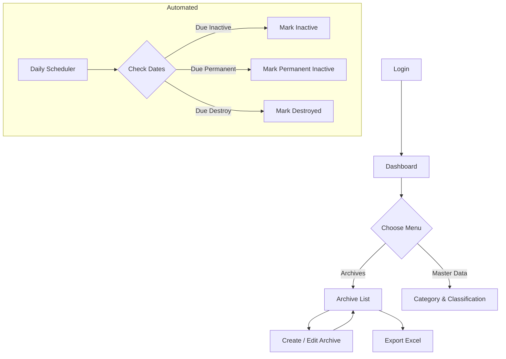

# Archive Management Module – Feature Overview

## 1. Purpose
This module provides end-to-end digital records management compliant with JRA Pergub 1 & 30 of East Java. It replaces manual, paper-based filing with a searchable, rule-driven archive that automatically enforces retention schedules and produces yearly disposal lists.

## 2. Actors & Roles
| Role | Description | Default Permissions |
|------|-------------|---------------------|
| **Admin** | System owner / Records manager | Full CRUD for all modules, role & permission management, Excel export |
| **Staff (Pegawai TU)** | Day-to-day archive clerk | CRUD for Archives, view masters, Excel export |
| **Internship Student** | Temporary read-only user | View & export lists only |

(Additional roles can be created dynamically via *Spatie Laravel-Permission*.)

## 3. Core Domain Entities
1. **Category** – High-level grouping derived from Pergub 1 (Jatim). Holds default retention values.
2. **Classification** – Hierarchical, unlimited depth tree (e.g. `01.02.03`). Child of a Category and carries its own retention values.
3. **Archive** – Concrete record item. References one Classification and one Category; stores metadata and calculated transition dates.

## 4. High-Level Workflow

**User Journey – Create Archive**
1. User clicks *“Create Archive”*.
2. Choose **Category** _or_ **Classification** (AJAX Select2). The counterpart dropdown auto-filters.
3. Upon Classification selection:
   * `retention_active` & `retention_inactive` auto-fill (read-only).
   * `index_number` can be generated or left blank.
4. User fills description, period (*kurun waktu*), and file count.
5. Submit → status = **Active**; transition dates calculated.

**Automated Status Transition**
* Nightly cron executes `UpdateArchiveStatusJob`.
* If `transition_active_due ≤ today` → status **Inactive**.
* If `transition_inactive_due ≤ today` →
  * `retention_inactive == 0` → **Destroyed**.
  * otherwise → **Permanent Inactive**.
* Each change is logged in audit trail.

## 5. Functional Capabilities
| Capability | Description |
|------------|-------------|
| Master Data Management | CRUD Category & Classification, CSV import, unlimited hierarchy (tree view). |
| Archive Registry | CRUD, search, filter, pagination (DataTables server-side). |
| Automated Retention | Daily scheduler updates status based on regulations. |
| Role-Based Access Control | Dynamic roles & permissions via Spatie package. |
| Audit Logging | All create/update/delete operations logged with before/after state (Spatie Activitylog). |
| Reporting & Export | Any current DataTable view exportable to Excel (Laravel-Excel). |
| Dashboard | Quick metrics: count per status, last added archives. |

## 6. Non-Functional Requirements
* **Performance** – Server-side pagination for large datasets.
* **Scalability** – Hierarchy unlimited; tested with ≥50 000 classifications.
* **Security** – Gate & Policy checks at controller level; CSRF protected forms.
* **Maintainability** – SOLID Laravel architecture, strictly typed models & FormRequest validation.
* **Localization** – All UI strings in Bahasa Indonesia, code comments in English.

## 7. Milestone Roadmap
1. Package installation & configuration.
2. Database migration + seeder scaffolding.
3. RBAC setup & policy guards.
4. CRUD UI for masters.
5. Archive CRUD + dependent dropdowns.
6. Scheduler & job.
7. Excel export & dashboard.
8. QA & deployment.

---
This overview serves as entry-level documentation for developers and product owners. Detailed schema and automation rules are provided in companion documents. 